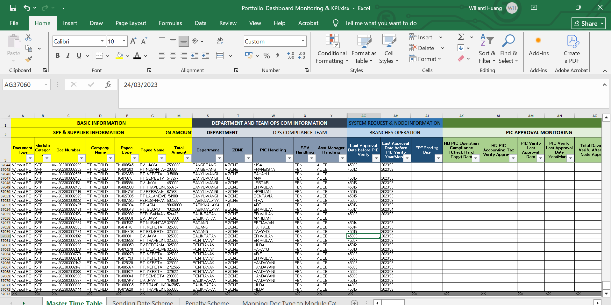

# 👋 Hi, I'm Wilianti Huang

**Freelance Accounting & Data Entry Specialist**

---

## 📚 Table of Contents

- [About Me](#-about-me)
- [Skills](#-skills)
- [Sample Projects](#-sample-projects)
- [Testimonials](#-testimonials)
- [Certifications](#-certifications)
- [Languages](#-languages)
- [Contact Me](#-contact-me)

---

## 👩‍💻 About Me

Hello! I’m Wilianti, a dedicated freelance accounting and data entry specialist with 6+ years of experience helping businesses keep their records accurate, organized, and confidential.

I love working with numbers, data, and people—making sure your information is always handled efficiently and professionally. Whether you need help with payments, bookkeeping, data entry, transcription, or research, I’m ready to help!

---

## 💡 Skills

- Fast and accurate data entry (40+ WPM)
- Spreadsheet management (Excel & Google Sheets)
- Data cleaning and formatting
- Web research & data mining
- PDF to Word/Excel conversion
- Data transcription (audio to text)
- Bookkeeping & payment processing
- Accounts receivable & payable management
- Strong attention to detail & confidentiality

---

## 🏆 Sample Projects

### 1. Client Financial Record & Database Management
**Client:** Major Travel Agency & Services Group (Australia, Confidential)  
**Tools:** JIRA, Calypso, Payment Gateways, Excel, Google Sheets, Google Workspace, Adobe Acrobat, Cruise Websites, WhatsApp  
**What I Did:**  
- Managed and processed ~5,000 client payments monthly  
- Maintained accurate financial records and accounts  
- Streamlined team workflows, removed duplicates, standardized data, and ensured payment accuracy

### 2. ERP System Consultant & Data Migration
**Client:** Chinese Consumer Electronics Company (Confidential)  
**Tools:** Kingdee ERP, Excel, Outlook, WeChat, WhatsApp, SQL Management, Power BI, Zentao, WeCom  
**What I Did:**  
- Migrated and organized data for over 2,000 products into Kingdee ERP  
- Created user guides and financial reports  
- Supported the full ERP implementation process—from requirements to post-launch support

### 3. Marketing Growth & Data Analysis
**Client:** Digital Mobile Network Operator (Indonesia, Confidential)  
**Tools:** Google Forms, Excel, Word, Adobe Analytics, Facebook Ads, Shopee Ads, Tokopedia Ads, Sisense, Metabase, Slack, Hotjar, VPN  
**What I Did:**  
- Updated and analyzed business action lists  
- Translated documents (English ↔ Indonesian)  
- Delivered competitor research and data analysis reports for business growth

#### 🔗 View sample files:
- [Portfolio Dashboard Monitoring & KPI (Excel)](Portfolio_Dashboard%20Monitoring%20%26%20KPI.xlsx)

#### 📊 Dashboard Preview

---

## 💬 Testimonials

> “Organized and great with time management. You handled tasks quickly and accurately. I highly recommend working with her again.”  
> — Finance & Accounting Cruise Team Leader

> “Wilianti delivered our project ahead of schedule and with perfect accuracy. Highly recommended!”  
> — Finance Accounting Manager, Chinese Consumer Electronics Company

> “Very reliable and detail-oriented. Will definitely hire again for data work.”  
> — Data Analysis Manager

---

## 🎓 Certifications

- Microsoft Excel Certification (PT. ATI BUSINESS GROUP, 2020)
- Bachelor of Economics in Accountancy (Tarumanagara University, 2015)
- Accurate Accounting Software Training (Tarumanagara University, 2014)
- Data Processing with SPSS Training (Tarumanagara University, 2012)
- MYOB Basics Training (Saint Marie High School Pekanbaru, 2010)

---

## 🌐 Languages

- Bahasa Indonesia (native)
- English (fluent)
- Mandarin Chinese (conversational)

---

## 📫 Contact Me

Looking for someone who cares about your data as much as you do?  
Let’s connect and see how I can help your business grow!

- **Email:** [wiliantihuang@gmail.com](mailto:wiliantihuang@gmail.com)
- **WhatsApp:** [+62 812-8449-8028](https://wa.me/6281284498028)
- **LinkedIn:** [Wilianti Huang](https://id.linkedin.com/in/wilianti-huang-07bab4b5/)
- **Upwork:** [Wilianti.W](https://www.upwork.com/freelancers/~01de347855df8588f0?mp_source=share)

---

*Thank you for visiting my portfolio!*

<!--
SEO: Freelance Data Entry Indonesia, Remote Bookkeeper Indonesia, Data Entry Specialist, Online Bookkeeping, Data Cleaning Services, Virtual Assistant Indonesia, Data Entry Freelancer, Remote Data Entry, Indonesia Data Entry Portfolio
-->
