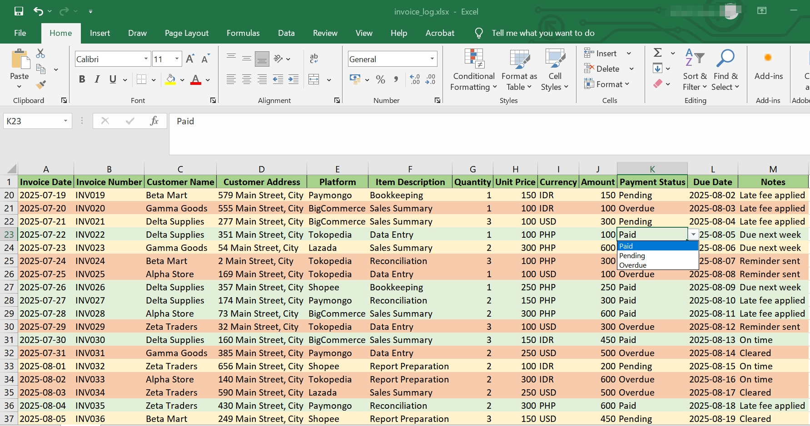

# 📁 Freelance Accounting & Data Entry Samples

This folder contains example files demonstrating how I help clients maintain accurate financial records and streamline their bookkeeping workflows.

## ✨ What's Included

- [📄 Sample Invoice Log Excel](./sample_invoice_log.xlsx)  
  A log of invoices showing dates, description, descriptions, quantity, unit price, amounts, and platform sources (Shopee, Paymongo).

- [📄 Cash Flow Summary](./cash_flow_summary.xlsx)  
  A monthly cash flow overview with income, expenses, and balances, formatted for clarity.

- [📄 Reconciliation Tracker](./reconciliation_tracker.xlsx)  
  A reconciliation template comparing internal records with bank and payment gateway statements.

> 💡 Note: All files are anonymized samples created for demonstration purposes.

---
