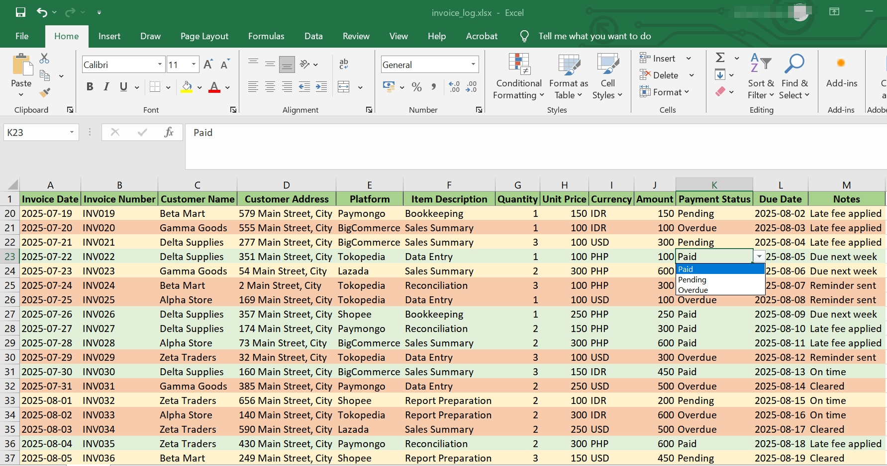
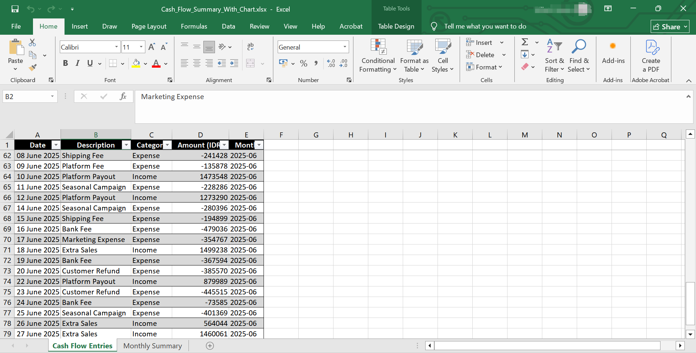
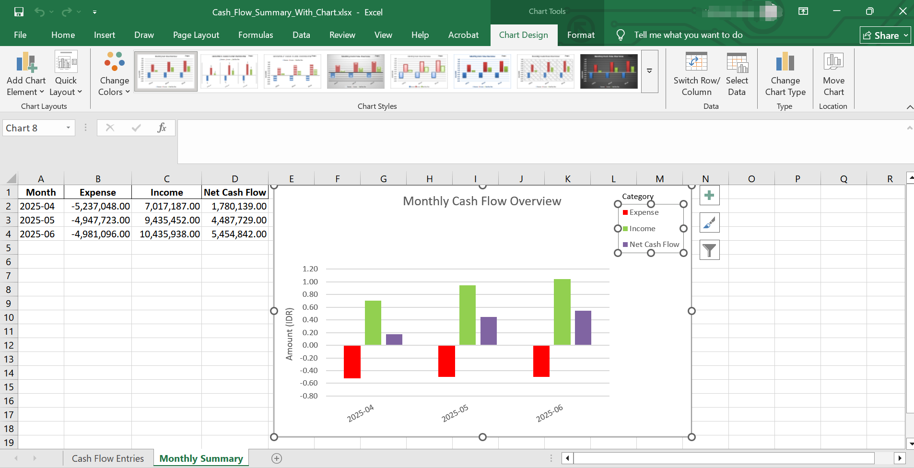

# 📁 Freelance Accounting & Data Entry Samples

This folder contains example files demonstrating how I help clients maintain accurate financial records and streamline their bookkeeping workflows.

## ✨ What's Included

- [📄 Sample Invoice Log Excel](./Sample_Invoice_log.xlsx)  
  A log of invoices showing dates, description, due date, quantity, unit price, amounts, and platform sources (Shopee, Paymongo).

- [📄 Cash_Flow_Summary Excel](./Cash_Flow_Summary_With_Chart.xlsx)  
  A log of cash flow summary showing dates, description, category and amounts.

)

> 💡 Note: All files are anonymized samples created for demonstration purposes.

---
